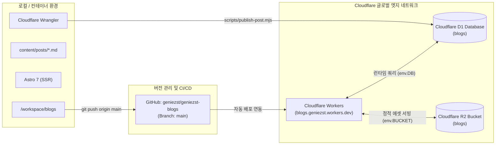

# blogs 시스템 종합 구조, 아키텍처 및 운영 가이드
(Blogs System Architecture, Content & Operations Guide)

본 문서는 `/workspace/blogs`에 구축된 2호 블로그(**스마트 라이프 & 머니**)의 인프라 아키텍처, 데이터베이스 구조, 콘텐츠 작성 표준, 배포 파이프라인 및 일상 운영 방법을 정리한 표준 매뉴얼입니다.

---

## 1. 플랫폼 및 인프라 아키텍처 (Infrastructure Stack)

본 블로그는 고성능 엣지 렌더링(SSR)과 안정적인 분산 트래픽 처리를 위해 **Cloudflare Workers** 위에 구축되어 있습니다.



### ⚠️ 인프라 불변 원칙 (Non-negotiable Rules)
1. **Cloudflare Workers 구조 유지:** 본 블로그는 Cloudflare Workers와 연동되어 작동합니다. **절대로 Cloudflare Pages 프로젝트로 전환하지 마십시오.**
2. **GitHub Push 기반 배포 연동:** `origin/main` 브랜치로 커밋 및 푸시되면 Cloudflare Workers에 자동 빌드 및 배포됩니다.
3. **완전한 리소스 격리:** `blog`, `cocipe`, `nudiet` 등 다른 프로젝트 및 Cloudflare 리소스는 절대 참조하거나 변경하지 마십시오.
4. **보안 비밀 유지:** API 토큰, `.env` 파일은 절대 Git에 커밋하지 않습니다.

---

## 2. 클라우드 리소스 스펙 (Cloudflare Resources)

| 리소스 구분 | 이름 (Name) | ID / 식별자 | 용도 및 바인딩 |
|---|---|---|---|
| **Account** | - | `875ed0ea82cff1960433efce7b4d2cf1` | Cloudflare 메인 계정 |
| **Workers Service** | `blogs` | `https://blogs.geniezst.workers.dev` | Astro SSR 앱 엣지 렌더링 |
| **D1 Database** | `blogs` | `cda318ea-89f1-45f8-84a6-11b44f758d6e` | `blog_posts`, `blog_categories` 등 |
| **R2 Storage** | `blogs` | `blogs` | 본문 이미지 및 미디어 에셋 저장 |
| **Git Repository** | `geniezst-blogs` | `https://github.com/geniezst/geniezst-blogs` | 메인 코드베이스 (`main` 브랜치) |

---

## 3. 디렉토리 구조 및 핵심 파일 역할

```text
/workspace/blogs/
├── content/
│   ├── posts/                   # 실제 발행된/발행할 마크다운 원본 파일 (.md)
│   └── temp/                    # 임시 작업 파일 디렉토리
├── data/
│   ├── auto-publish.log         # 스케줄러 실행 로그
│   └── auto-publish-state.json  # 카테고리별 발행 누적 통계 및 세션 이력
├── docs/
│   ├── SPEC.md                  # 기술 사양서
│   ├── POST_STYLE_GUIDE.md      # 생활경제/복지 전문 글쓰기 가이드
│   └── BLOGS_SYSTEM_GUIDE.md    # 시스템 종합 가이드
├── migrations/
│   ├── 0001_initial_schema.sql  # D1 기본 테이블 스키마 DDL
│   └── 0002_seed_categories.sql # 카테고리 6개 초기 데이터 시드
├── public/                      # 파비콘, 폰트 등 정적 웹 자산
├── scripts/
│   ├── publish-post.mjs         # 개별 마크다운 파일 D1/R2 발행 CLI 도구
│   ├── telegram-notify.mjs      # 텔레그램 발행 완료/실패 보고 전송기
│   ├── auto-publish-runner.mjs  # 11:30 & 18:30 KST 자동화 스케줄러 데몬
│   └── service.sh               # 백그라운드 데몬 관리 스크립트
├── src/                         # Astro 7 SSR 소스코드 (페이지, 레이아웃, 컴포넌트)
├── astro.config.mjs             # Cloudflare Workers 어댑터 설정
├── package.json                 # 프로젝트 의존성 설정
└── wrangler.jsonc               # Cloudflare 바인딩 (D1: blogs, R2: blogs)
```

---

## 4. 일상 운영 및 수동 명령어 요약

### 4.1 포스트 수동 즉시 발행
```bash
cd /workspace/blogs
node scripts/publish-post.mjs content/posts/sample-post.md
```

### 4.2 스케줄러 세션 수동 테스트
```bash
cd /workspace/blogs
# 점심 세션 테스트 실행
node scripts/auto-publish-runner.mjs lunch

# 저녁 세션 테스트 실행
node scripts/auto-publish-runner.mjs evening
```

### 4.3 백그라운드 서비스 관리
```bash
cd /workspace/blogs
bash scripts/service.sh status   # 상태 확인
bash scripts/service.sh start    # 데몬 시작 (setsid)
bash scripts/service.sh stop     # 데몬 중지
bash scripts/service.sh restart  # 데몬 재시작
```
