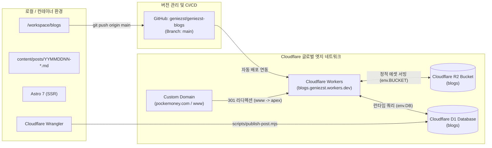

# blogs (포켓머니 - pockemoney) 시스템 종합 구조, 아키텍처 및 운영 가이드
(Blogs System Architecture, Content & Operations Guide)

본 문서는 `/workspace/blogs`에 구축된 생활 금융 & 복지 혜택 전문 블로그 **포켓머니 (pockemoney)**의 인프라 아키텍처, 데이터베이스 구조, 콘텐츠 작성 표준, 배포 파이프라인 및 일상 운영 방법을 총망라한 표준 매뉴얼입니다.

---

## 1. 플랫폼 및 인프라 아키텍처 (Infrastructure Stack)

본 블로그는 고성능 엣지 렌더링(SSR)과 안정적인 분산 트래픽 처리를 위해 **Cloudflare Workers** 위에 구축되어 있습니다.



### ⚠️ 인프라 불변 원칙 (Non-negotiable Rules)
1. **Cloudflare Workers 구조 유지:** 본 블로그는 Cloudflare Workers와 연동되어 작동합니다. **절대로 Cloudflare Pages 프로젝트로 전환하지 마십시오.**
2. **GitHub Push 기반 배포 연동:** `origin/main` 브랜치로 커밋 및 푸시되면 Cloudflare Workers에 자동 빌드 및 배포됩니다.
3. **대표 도메인 일관성:** 대표 도메인은 `https://pockemoney.com`이며, `www` 요청은 [`src/middleware.ts`](../src/middleware.ts)에서 301 영구 리디렉션 처리됩니다.
4. **완전한 리소스 격리:** `blog`, `cocipe`, `nudiet` 등 다른 프로젝트 및 Cloudflare 리소스는 절대 참조하거나 변경하지 마십시오.
5. **보안 비밀 유지:** API 토큰, `.env` 파일은 절대 Git에 커밋하지 않습니다.

---

## 2. 클라우드 리소스 스펙 (Cloudflare Resources)

| 리소스 구분 | 이름 (Name) | ID / 식별자 | 용도 및 바인딩 |
|---|---|---|---|
| **Account** | - | `875ed0ea82cff1960433efce7b4d2cf1` | Cloudflare 메인 계정 (`geniezst`) |
| **대표 도메인** | `pockemoney.com` | `https://pockemoney.com` | 공식 서비스 도메인 (SSL & CDN 적용) |
| **서브 도메인** | `www.pockemoney.com` | `https://www.pockemoney.com` | 301 영구 리디렉션 적용 |
| **Workers Service** | `blogs` | `https://blogs.geniezst.workers.dev` | Astro SSR 앱 엣지 렌더링 Worker |
| **D1 Database** | `blogs` | `cda318ea-89f1-45f8-84a6-11b44f758d6e` | `blog_posts`, `blog_categories` 등 테이블 |
| **R2 Storage** | `blogs` | `blogs` | 본문 이미지 및 미디어 에셋 저장 버킷 |
| **Git Repository** | `geniezst-blogs` | `https://github.com/geniezst/geniezst-blogs` | 메인 코드베이스 (`main` 브랜치) |

---

## 3. 핵심 아키텍처 및 최근 주요 구현 내역

### 3.1 포켓몬풍 pockemoney 히어로 배너 타이포그래피
- **적용 위치:** [`src/layouts/BaseLayout.astro`](../src/layouts/BaseLayout.astro)
- **특징:**
  - 상업용 무료 오픈소스 폰트 `Titan One` (Google Fonts) 적용.
  - 노란색 본문(`#FFDE00`) + 파란색 스트로크(`3px #2A75BB`) + 네이비 뎁스(`0 4px #18446E`) + 부드러운 소프트 블러 섀도우(`0 6px 14px rgba(0,0,0,0.45)`).
  - **그림자 잘림 방지:** `line-height: 1.25`, `padding: 0.15em 0.4em`, 경쾌한 전진감을 주는 `transform: skewX(-4deg)`.
  - **정적 안정성:** 시각적 피로감을 주는 마우스 오버(Hover) 애니메이션 제거.

### 3.2 컨텐츠 가로폭 초과 (Overflow) 원천 방어 (Defensive Design)
- **배경:** W3C Flexbox Level 1 규격에 따라 flex item(`<article>`)의 기본값은 `min-width: auto`로, 내부의 긴 코드나 테이블(`min-content`) 크기만큼 부모 카드가 찢어지는 현상 발생.
- **해결 방어선:**
  1. [`src/pages/blog/[slug].astro`](../src/pages/blog/[slug].astro): `<article class="flex-1 w-full min-w-0 card-base p-6 sm:p-10 overflow-hidden">`
  2. [`src/lib/markdown.ts`](../src/lib/markdown.ts): `code`, `table`, `image` 래퍼에 `w-full max-w-full min-w-0` 및 overflow 제약 일괄 적용.
  3. [`src/styles/article.css`](../src/styles/article.css): `.article-content`에 `max-width: 100%; min-width: 0;`, `:not(pre) > code` 및 `a`에 `word-break: break-all; overflow-wrap: anywhere;` 강제 적용.
  4. 시각화 금융 차트 6종 컴포넌트에 `max-width: 100%; min-width: 0; overflow-hidden` 방어선 구축.

### 3.3 표(Table) 괄호 줄바꿈 서브텍스트 & 슬림 가로 스크롤바
- **괄호 서브텍스트 변환 (`markdown.ts`):**
  - 표 데이터 셀(`<td>`) 내 `약 542만원 (세후 15.4% 과세)` 형태의 부연 설명을 `<br><span class="table-subtext block text-xs opacity-75 mt-0.5 text-neutral-500 font-normal">$1</span>`로 자동 치환.
  - HTML 태그 속성(`href`), `<code>` 태그 내부, 셀 선두 괄호(`(주)`, `(1)`), 전각 괄호(`（...）`), 헤더 셀(`<th>`) 엣지 케이스 완벽 방어.
- **조건부 슬림 가로 스크롤바 (`article.css`):**
  - `overflow-x: auto;` 및 투명 트랙으로 내용이 넘칠 때만 5px 슬림 미니멀 스크롤바 노출.
  - 완전 둥근 알약형 썸, hover 불투명도 피드백, Firefox W3C 표준 및 WebKit/모바일 터치 스크롤 지원.

### 3.4 자동 발행 스케줄러 & 주 1회 랜덤 휴식 규칙
- **스크립트:** [`scripts/auto-publish-runner.mjs`](../scripts/auto-publish-runner.mjs)
- **실행 모드:** 백그라운드 무중단 데몬 (`setsid`)
- **스케줄:**
  - 점심 세션: 11:15 ~ 11:45 KST 사이 랜덤 1회
  - 저녁 세션: 18:15 ~ 18:45 KST 사이 랜덤 1회
- **주간 변칙 휴식 규칙 (절대 제거 금지):**
  - `checkOrUpdateWeeklySkip()` 함수를 통해 매주 0~6(일~토) 중 랜덤 1개 요일을 선정.
  - 선정된 요일에는 **점심 세션을 쉬고(스킵), 저녁에만 1회 발행**하여 자연스러운 운영 리듬 유지.
  - 2026-W39 주간 배정: **일요일** 점심 휴식 (저녁 1회만 발행).

---

## 4. 디렉토리 구조 및 핵심 파일 역할

```text
/workspace/blogs/
├── content/
│   ├── posts/                   # 실제 발행된/발행할 마크다운 원본 (YYMMDDNN-slug.md)
│   └── temp/                    # 임시 작업 파일
├── data/
│   ├── auto-publish.log         # 스케줄러 실행 로그
│   └── auto-publish-state.json  # 카테고리별 발행 누적 통계 및 세션 이력
├── docs/
│   ├── POST_STYLE_GUIDE.md      # 생활금융/복지 글쓰기 및 차트 작성 표준 가이드
│   └── BLOGS_SYSTEM_GUIDE.md    # 시스템 종합 가이드 (본 문서)
├── migrations/
│   ├── 0001_initial_schema.sql  # D1 기본 테이블 스키마 DDL
│   └── 0002_seed_categories.sql # 6대 카테고리 초기 데이터 시드
├── public/                      # 파비콘, 폰트 등 정적 웹 자산
├── scripts/
│   ├── publish-post.mjs         # 개별 마크다운 파일 D1/R2 발행 CLI 도구
│   ├── telegram-notify.mjs      # 텔레그램 발행 완료/실패 보고 전송기
│   ├── auto-publish-runner.mjs  # 자동화 스케줄러 데몬 (점심 & 저녁 발행)
│   └── service.sh               # 데몬 관리 스크립트
├── src/
│   ├── components/              # Header, Footer, Sidebar, PostCard, SEO 등
│   ├── layouts/BaseLayout.astro # 전역 레이아웃 및 pockemoney 히어로 배너
│   ├── lib/
│   │   ├── db.ts                # D1 데이터베이스 쿼리 함수
│   │   └── markdown.ts          # Marked v15 커스텀 렌더러 (표/코드/차트)
│   ├── middleware.ts            # www.pockemoney.com -> pockemoney.com 301 리디렉션
│   ├── pages/                   # Astro 라우팅 엔드포인트
│   ├── site.config.ts           # 블로그 전역 설정 (URL: https://pockemoney.com)
│   └── styles/
│       ├── article.css          # 본문 타이포그래피, 표 서브텍스트, 슬림 스크롤바, 차트
│       └── global.css           # 전역 스타일 및 Pretendard 폰트
├── astro.config.mjs             # Astro 7 설정 (site: https://pockemoney.com)
├── package.json                 # 프로젝트 의존성 설정
└── wrangler.jsonc               # Cloudflare 바인딩 (D1: blogs, R2: blogs)
```

---

## 5. 일상 운영 및 관리 명령어 레퍼런스

모든 명령어는 `/workspace/blogs` 디렉토리에서 실행합니다.

### 5.1 빌드 및 배포
```bash
# 로컬 개발 서버
npm run dev

# 프로덕션 빌드 무결성 검증
npm run build

# GitHub 푸시 (Cloudflare 자동 엣지 배포 트리거)
git add .
git commit -m "feat: your commit message"
git push origin main
```

### 5.2 포스트 수동 즉시 발행
```bash
node scripts/publish-post.mjs content/posts/26092301-example-slug.md
```

### 5.3 스케줄러 데몬 관리
```bash
# 데몬 상태 확인
ps aux | grep auto-publish-runner | grep blogs

# 데몬 무중단 백그라운드 시작
setsid node scripts/auto-publish-runner.mjs daemon >> data/auto-publish.log 2>&1 &

# 데몬 중지
pkill -f "blogs/scripts/auto-publish-runner.mjs daemon"

# 점심 / 저녁 세션 수동 테스트 실행
node scripts/auto-publish-runner.mjs lunch
node scripts/auto-publish-runner.mjs evening
```
