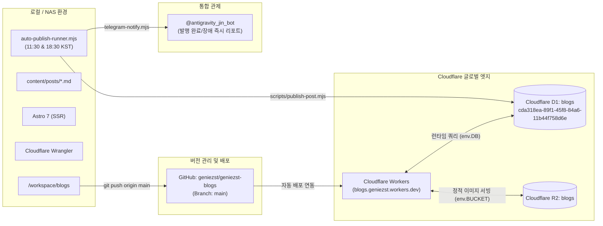

# blogs 블로그 기술 사양서 (Specification)

- **작성일:** 2026-09-18
- **작성자:** @pm (제품 관리자)
- **프로젝트 위치:** `/workspace/blogs`
- **저장소:** `geniezst/geniezst-blogs` (main)
- **배포 타깃:** Cloudflare Workers (`blogs.geniezst.workers.dev`)

---

## 1. 프로젝트 개요

본 프로젝트는 고수익 애드센스 및 검색 유입 극대화를 위해 기획된 제2 블로그(**스마트 라이프 & 머니**) 구축 및 자동 운영 시스템 구축을 목표로 합니다.

기존 1호 IT/테크 블로그(`/workspace/blog`)와 함께 시너지 효과를 창출할 수 있도록 대중적인 검색량이 가장 높은 **생활 경제, 정부 지원금/복지 혜택, 연말정산/절세 환급, 스마트 금융/예적금** 분야를 전문적으로 다룹니다.

### 핵심 방향성
1. **대중적 검색 유입 극대화:** 직장인, 주부, 청년, 소상공인 등 전 국민이 상시 검색하는 필수 생활 금융 정보 중심
2. **명확한 독자 행동 유도 (Actionable CTA):** 자격 요건 체크리스트, 신청 방법 3단계, 놓치기 쉬운 주의사항을 직관적으로 제공
3. **수익화 최적화:** Google AdSense 고단가 키워드(금융, 대출, 세금, 지원금) 구조화 및 전환율 최적화
4. **철저한 인프라 및 리소스 격리:** 1호 블로그(`blog`), 기존 서비스(`cocipe`, `nudiet`)와 완벽 분리된 D1, R2, Workers, GitHub 리소스 운용

---

## 2. 시스템 아키텍처

---

## 3. 리소스 및 보안 격리 규격 (절대 준수)

| 리소스 구분 | 할당 대상 (오직 이것만 사용) | 절대 접근 금지 대상 |
|---|---|---|
| Cloudflare Account ID | `875ed0ea82cff1960433efce7b4d2cf1` | - |
| Cloudflare Workers | `blogs` (`blogs.geniezst.workers.dev`) | `blog`, `cocipe` |
| Cloudflare D1 | `blogs` ID: `cda318ea-89f1-45f8-84a6-11b44f758d6e` | `blog`, `cocipe` |
| Cloudflare R2 | `blogs` | `blog`, `cocipe` |
| GitHub 저장소 | `geniezst/geniezst-blogs` (main) | `geniezst-blog`, `cocipe` |
| 로컬 디렉토리 | `/workspace/blogs` | `/workspace/projects/*`, `/workspace/blog` (단독 참조 외 수정 금지) |
| 보안 토큰 | `.env` (Git 커밋 절대 금지) | 로그 출력 및 Git push 금지 |

---

## 4. D1 데이터베이스 구조 및 카테고리 구성

### 4.1 카테고리 정의 (`blog_categories`)

| id | slug | name | description | order_index |
|---|---|---|---|---|
| 1 | `welfare` | 정부 지원금 & 복지 | 놓치면 손해보는 청년, 직장인, 서민 정책 금융 및 복지 혜택 | 1 |
| 2 | `tax` | 연말정산 & 환급/절세 | 숨은 환급금 조회, 소득공제 꿀팁 및 종합소득세 실전 가이드 | 2 |
| 3 | `finance` | 예적금 & 금융 꿀팁 | 고금리 파킹통장, 특판 예적금 금리 비교, 청약 및 ISA 활용법 | 3 |
| 4 | `saving` | 생활비 절약 & 공과금 | 전기세, 가스비, 통신비 절약 팁 및 카드 피킹률 극대화 노하우 | 4 |
| 5 | `subsidy` | 소상공인 & 정책자금 | 소상공인 지원금, 희망리턴패키지, 저금리 대환 대출 및 창업 지원 | 5 |
| 6 | `life-tips` | 생활 행정 & 필수 팁 | 정부24 민원 서류 발급, 과태료 감경법 및 유용한 일상 생활 상식 | 6 |

---

## 5. 자동 발행 스케줄 및 교차 운영 정책

1호 IT 블로그와 2호 생활경제 블로그는 서로 피크 트래픽 시간대가 다르므로, 다음과 같이 4타임 교차 배포 체계를 운영합니다:

- **08:00 KST (출근길):** 1호 IT/테크 블로그 (`/workspace/blog`)
- **11:30 KST (점심시간 직전):** 2호 생활경제 블로그 (`/workspace/blogs`)
- **18:30 KST (퇴근길/저녁):** 2호 생활경제 블로그 (`/workspace/blogs`)
- **21:30 KST (취침 전 심야):** 1호 IT/테크 블로그 (`/workspace/blog`)

---

## 6. 서비스 관리 및 백그라운드 구동

- 데몬 실행 방식: Linux `setsid`를 통한 완전 분리 (PPID 0)
- 관리 스크립트: `/workspace/blog/scripts/service.sh` 및 `/workspace/blogs/scripts/service.sh`
- 알림 시스템: Telegram Bot API (`sendTelegramReport`) 연동 완료
